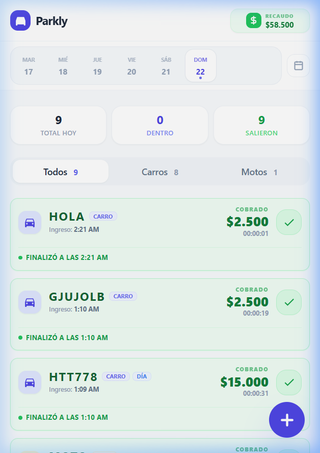

# Parkly

[](https://parkly-59b18.web.app)

Parkly es una aplicación minimalista y funcional para la gestión de parqueaderos en tiempo real, construida con **Angular v21** y **Tailwind CSS v4**.

## 🚀 Demo en Vivo
Puedes acceder a la aplicación desplegada aquí: [https://parkly-59b18.web.app](https://parkly-59b18.web.app)

## 📸 Vista Previa


## Características Principales
- **Gestión en Tiempo Real**: Registro de entrada y salida de vehículos (Carros y Motos).
- **Cálculo de Tarifas**: Lógica automatizada basada en tiempos de estadía.
- **Tarifa Especial Día**: Opción para vehículos con tarifa plana diaria ($15,000).
- **Dashboard Intuitivo**: Resumen de recaudo y flujo de vehículos diario.
- **Diseño Moderno**: Interfaz limpia, responsiva y con modo oscuro/claro optimizado.

---

## Development server

To start a local development server, run:

```bash
ng serve
```

Once the server is running, open your browser and navigate to `http://localhost:4200/`. The application will automatically reload whenever you modify any of the source files.

## Code scaffolding

Angular CLI includes powerful code scaffolding tools. To generate a new component, run:

```bash
ng generate component component-name
```

For a complete list of available schematics (such as `components`, `directives`, or `pipes`), run:

```bash
ng generate --help
```

## Building

To build the project run:

```bash
ng build
```

This will compile your project and store the build artifacts in the `dist/` directory. By default, the production build optimizes your application for performance and speed.

## Running unit tests

To execute unit tests with the [Vitest](https://vitest.dev/) test runner, use the following command:

```bash
ng test
```

## Running end-to-end tests

For end-to-end (e2e) testing, run:

```bash
ng e2e
```

Angular CLI does not come with an end-to-end testing framework by default. You can choose one that suits your needs.

## Additional Resources

For more information on using the Angular CLI, including detailed command references, visit the [Angular CLI Overview and Command Reference](https://angular.dev/tools/cli) page.
